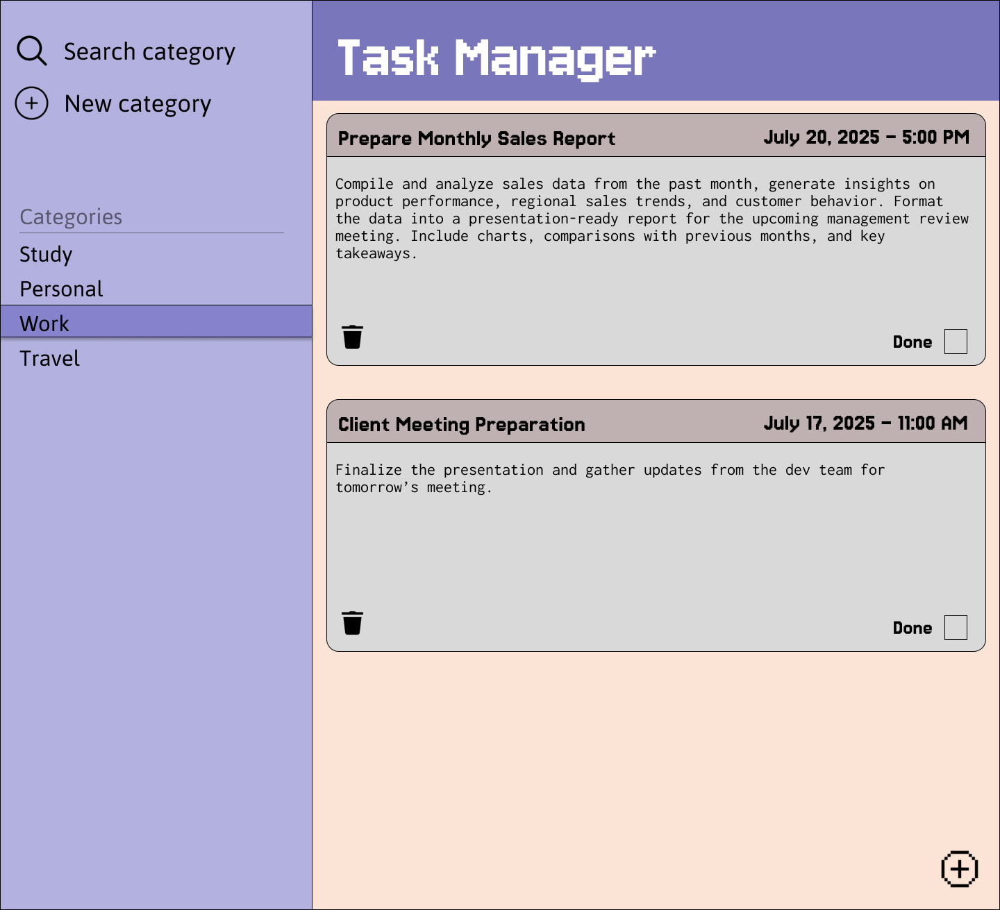

# 📝 Task Manager Web Application

A simple and intuitive Task Manager web app . Users can create, update, and delete tasks with a clean user interface.

---

## 📸 UI Screenshots

---

## 🚀 Features

- Create, update, delete tasks
- Mark tasks as completed
- Set deadlines for competing tasks
- Create categories for different tasks
- Responsive design
- Simple and clean UI

---

## 🛠 Tech Stack

- **Frontend** - React.js
- **Backend** - SpringBoot
- **Database** - PostgreSQL

---

## ⚙️ How to Run the Project Locally

### 🔹 Prerequisites

- Java 17+ and Maven installed
- Node.js and npm installed
- PostgreSQL server running
- Optional: Postman for API testing
- Configure database in application.properties
---

### 🔸 Run Backend (Spring Boot)

Navigate to the backend folder and use this command:

  ./mvnw spring-boot:run

### 🔸 Run Frontend (React)

Navigate to the frontend folder and use this command:

  -npm install
  -npm start
